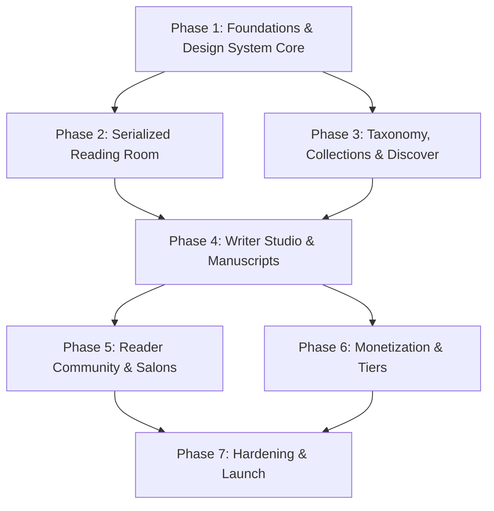

# Project Roadmap & Implementation Phases — Stories by Relay (Hatchpen)

**Document Version:** 1.0.0  
**Status:** Living Canonical Roadmap  
**Scope:** Engineering Milestones, Feature Delivery Phases, and Release Gates  
**Last Updated:** October 2026  

---

## 1. Roadmap Overview & Philosophy

The development of **Stories by Relay (Hatchpen)** is divided into discrete, structured phases. Each phase establishes a robust foundation before advancing to high-order editorial and community features, adhering strictly to:
- **`PRD.md`**: Core requirements, episodic hierarchy (`Work ➔ Act ➔ Chapter`), and weekly collections.
- **`Architecture.md`**: TanStack Start, Nitro server functions, and file structure.
- **`rules.md`**: Mandatory component reuse, zero auth regression, and strict SEO compliance.

```
┌────────────────────────────────────────────────────────────────────────┐
│                          DEVELOPMENT PHASES                            │
│                                                                        │
│   Phase 1: Foundations & Design System Core            [COMPLETED]     │
│   Phase 2: Serialized Reading Room & Typography        [COMPLETED]     │
│   Phase 3: Taxonomy, Collections & Discovery Engine    [COMPLETED]     │
│   Phase 4: Writer Studio & Manuscript Management       [ACTIVE]        │
│   Phase 5: Reader Community, Social Salons & Notes     [UPCOMING]      │
│   Phase 6: Monetization, Memberships & Tiers           [PLANNED]       │
│   Phase 7: Production Hardening, Audit & Scale         [FINAL GATE]    │
└────────────────────────────────────────────────────────────────────────┘
```

---

## 2. Phase Breakdown & Status

### Phase 1: Foundations, Infrastructure & Design System Core
> **Status:** ✅ Completed  
> **Objective:** Establish the foundational monochrome editorial design system, authentication bridges, and type-safe routing.

#### Key Deliverables:
- [x] **Project Scaffolding**: Setup TanStack Start, Nitro, React 19, Vite, and Tailwind CSS v4.
- [x] **Semantic Design Tokens**: Configuration of `--bg-*`, `--border-*`, and `--ink-*` monochrome variables.
- [x] **Unified Motion Physics**: Spring configurations (`SPRINGS.snappy`, `SPRINGS.smooth`, `SPRINGS.bouncy`).
- [x] **Core Primitives Catalog**:
  - Tactile Buttons, Badges, Modals, Drawers, Sliders.
  - `AnimatedTabs` (continuous sliding pill tabs with `layoutId`).
  - `DiscreteTabs` & `DiscreteDisclosureTabs` (expanding tabs with anchored dropdown popups).
  - Search variants (`AnimatedSearch`, `OmniSearch`, `PaletteSearch` Cmd+K).
  - Watermelon tactile card suite (9 interactive card primitives).
- [x] **Design System Laboratory**: Interactive showcase at `/design-system` with Canvas vs. Docs modes.
- [x] **Identity & Auth Bridge**: Integration of Clerk (`@clerk/react`), user sync (`ClerkSync.tsx`), and profile onboarding.

---

### Phase 2: Serialized Reading Room & Editorial Typography
> **Status:** ✅ Completed  
> **Objective:** Build an immersive, distraction-free reading room with dynamic typographic controls.

#### Key Deliverables:
- [x] **Reading Room Architecture**: Dynamic route `/read/$workId/$chapterId`.
- [x] **Tri-Theme Engine**: Seamless instant switching between Light (Paper), Obsidian Dark, and Warm Sepia.
- [x] **Tactile Sliders**: Live adjustments for font size (`14px - 32px`) and column width (`480px - 960px`).
- [x] **Episodic Chapter Navigation**: Next/Previous chapter transitions and chapter selection drawer.
- [x] **Reading Persistence**: Automatic tracking of reading progress percentages and last read timestamps.
- [x] **End-of-Chapter Sentiment**: Interactive critique and rating ornament (`FeedbackComponent`).

---

### Phase 3: Canonical Taxonomy, Collections & Discovery Engine
> **Status:** ✅ Completed  
> **Objective:** Implement canonical categories, grouped genres, and time-based weekly collections logic.

#### Key Deliverables:
- [x] **16 Canonical Categories**: Integration of all 16 categories from `live_instructions.md` with slug indexing.
- [x] **Grouped Literary Genres**: Categorized genre groupings (Literary, Thriller, Speculative, Romance, etc.).
- [x] **Automatic Weekly Collections**:
  - `New Chapters This Week`: Monday–Sunday calendar calculation; strictly triggered only when a new Act or Chapter is published.
  - `New This Week`: Brand new works published within the current 7 days.
  - `Trending Now`, `Rising Stories`, and `Completed Works`.
- [x] **Discover Route (`/discover`) Overhaul**:
  - Upper row layout with primary `AnimatedTabs` (collection selection) and secondary `DiscreteDisclosureTabs` (Sort, Status, Genre filters).
  - Filter reset capabilities.
  - Category pill strip with `whitespace-nowrap shrink-0` protection.
  - Search and SEO metadata integration.

---

### Phase 4: Writer Studio & Manuscript Management
> **Status:** 🟡 Active / In Progress  
> **Objective:** Empower serialized writers to draft, organize, and publish multi-act works with real-time analytics.

#### Key Deliverables:
- [x] **Manuscript Dashboard (`/write`)**: Ledger of author works with draft, review, and published badges.
- [x] **Project Creation Wizard (`/write/new`)**: Metadata, cover selection, canonical category, and genre tagging.
- [x] **Structure Manager (`/write/manage/$workId`)**: Hierarchical tree management (`Work ➔ Act ➔ Chapter`).
- [x] **Prose Editor (`/write/editor/$workId/$chapterId`)**: Distraction-free Markdown editor with word counts and status switches.
- [x] **Admin Work Editor (`/admin-work-editor.$workId`)**: Administrative chapter ingestion and collection tag audits.
- [ ] **Scheduled Chapter Release**: Automated publishing schedule for serialized chapter drops.
- [ ] **Co-Author & Editor Collaboration**: Role-based permissions for reviewing drafts and line edits.
- [ ] **Advanced Readership Analytics (`/write/analytics/$workId`)**: Chapter drop-off graphs and subscriber conversion funnels.

---

### Phase 5: Reader Community, Social Salons & Notes
> **Status:** 🔵 Upcoming  
> **Objective:** Cultivate high-signal literary engagement without social media feed noise.

#### Key Deliverables:
- [ ] **Marginalia & In-Line Paragraph Annotations**: Highlight and critique specific sentences or paragraphs.
- [ ] **Literary Salons & Circles (`CreateCommunity`)**: Dedicated reading groups and monthly book clubs.
- [ ] **Author Dispatches & Newsletters**: Serial updates delivered to subscriber folios.
- [ ] **Curator Booklists & Anthologies**: User-curated reading lists with editorial forewords.
- [ ] **Enhanced Notification Stream**: Granular alerts for subscribed author drops and comment replies.

---

### Phase 6: Monetization, Memberships & Tiers
> **Status:** ⚪ Planned  
> **Objective:** Enable direct author compensation and premium subscriber folios.

#### Key Deliverables:
- [ ] **Patron Subscriptions**: Monthly reader sponsorships for serialized authors.
- [ ] **Early-Access Chapter Tiers**: Paywalled advance chapters with timed public release gates.
- [ ] **Virtual Ink / Tips**: Micro-transactions supporting authors at chapter milestones.
- [ ] **Author Payout Dashboard**: Financial reporting and payout method management.

---

### Phase 7: Production Hardening, Audit & Launch Gates
> **Status:** ⚪ Final Gate  
> **Objective:** Performance optimization, accessibility, and search engine dominance.

#### Key Deliverables:
- [ ] **End-to-End SEO Audit**: Structured Data testing across all public manuscript and author folios.
- [ ] **Accessibility (a11y) Verification**: Full keyboard navigation, screen reader checks, and ARIA audits.
- [ ] **Lighthouse Performance Optimization**: 95+ scores on Performance, Accessibility, Best Practices, and SEO.
- [ ] **Comprehensive Test Coverage**: Unit tests for collection calculation algorithms and E2E critical flows.
- [ ] **Final Deployment Hardening**: Nitro edge deployment verification and CDN asset caching.

---

## 3. Phase Dependency Graph


