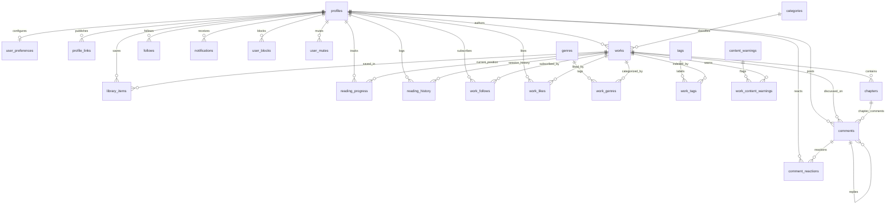

# Tellnest — Database Schema & Architecture Reference

This document provides the definitive architectural specification for the **Tellnest** PostgreSQL database hosted on Supabase, matching migrations `01` through `08`.

---

## 1. Architectural Philosophy & Core Hierarchy

Tellnest is designed around the core content model:

$$\text{Clerk User} \longrightarrow \text{profiles} \longrightarrow \text{works} \longrightarrow \text{chapters}$$

### Key Architectural Tenets
1. **Clerk is the Identity Provider**: Clerk owns authentication, OAuth, sessions, and passwords. Supabase PostgreSQL owns application data, profiles, works, and interactions.
2. **Deterministic Canonical URLs**:
   - Work: `/work/{slug}`
   - Author: `/author/{username}`
   - Category: `/category/{slug}`
   - Genre: `/genre/{slug}`
3. **Strict Separation of Concerns**:
   - `ongoing` (lifecycle status) $\neq$ `published` (publication status).
   - `public` (visibility) $\neq$ `indexable` (SEO sitemap eligibility).
   - `library` (saving) $\neq$ `follow` (author/work subscription).
   - `reading_progress` (current position) $\neq$ `reading_history` (historical activity).
4. **Row Level Security (RLS) on Every Table**: Unauthenticated users cannot read private drafts, and authors can only write to their own resources.

---

## 2. Entity Relationship Diagram (ERD)



---

## 3. Gap Analysis Table (Step 2 Audit)

| Area | Prior Implementation | Tellnest Production DB | Implementation Action |
|---|---|---|---|
| **Identity / Profiles** | Mock author objects | `profiles` table with `clerk_user_id`, normalized `username`, `display_name`, `account_status` | Created in Migration `02` with RLS |
| **User Preferences** | Client state only | `user_preferences` table (reading mode, adult content flag, notification channels) | Created in Migration `02` |
| **Profile Links** | Inline in mock | `profile_links` (platform, url, display_order) | Created in Migration `02` |
| **Taxonomy** | Hardcoded client arrays | `categories`, `genres`, and `work_genres` junction | Created in Migration `03` & `04`, seeded in `08` |
| **Discovery Tags** | String array | `tags` and `work_tags` junction table | Created in Migration `03` & `04` |
| **Content Safety** | Simple boolean `isMature` | `content_warnings` & `work_content_warnings` junction | Created in Migration `03` & `04`, seeded in `08` |
| **Works** | Mock objects | `works` with lifecycle status, visibility, publication status, ratings, engagement counts | Created in Migration `04` with GIN search index |
| **Chapters** | Mock array | `chapters` with `chapter_number`, unique constraints, reading times, indexability | Created in Migration `04` |
| **Library** | Memory / mock | `library_items` with unique `(user_id, work_id)` | Created in Migration `05` |
| **Reading Position** | Temporary client state | `reading_progress` (position offset, percent) & `reading_history` (time sessions) | Created in Migration `05` |
| **Engagement** | Mock counters | `follows`, `work_follows`, `work_likes`, `comments`, `comment_reactions` | Created in Migration `05` |
| **Notifications** | Mock list | Polymorphic `notifications` with `metadata` JSONB | Created in Migration `05` |
| **Moderation** | None | `moderation_reports`, `moderation_actions`, `audit_logs` | Created in Migration `06` |
| **User Safety** | None | `user_blocks`, `user_mutes` | Created in Migration `02` |
| **Analytics** | Hardcoded stats | Minimal `analytics_events` for views and completion | Created in Migration `06` |

---

## 4. Complete Table Dictionary (27 Production Tables)

### 4.1. Core Identity & User Safety
- **`profiles`**: Application user entity linked to Clerk (`clerk_user_id`). Holds public username, display name, avatar path, bio, and account status (`active`, `suspended`, `banned`, `deactivated`).
- **`user_preferences`**: Reader and writer settings (font size, reading mode, theme, adult content toggle, email/push notification settings).
- **`profile_links`**: External websites and social links for author profiles (`platform`, `url`, `display_order`).
- **`user_blocks`**: Mutual interaction blocking (`blocker_id`, `blocked_id`).
- **`user_mutes`**: Muted users for feed and notifications (`muter_id`, `muted_id`).

### 4.2. Controlled Taxonomy
- **`categories`**: Controlled platform taxonomy (`Fiction`, `Novels`, `Poetry`, `Essays`, `Serialized Stories`, etc.).
- **`genres`**: Controlled literary genres (`Romance`, `Fantasy`, `Mystery`, `Sci-Fi`, `Thriller`, etc.).
- **`tags`**: Flexible discovery tags for product search (non-indexable by default to avoid thin content).
- **`content_warnings`**: Standardized reader warnings (`Violence`, `Self-harm`, `Sexual Themes`, etc.).

### 4.3. Content Model
- **`works`**: Master manuscript table. Includes title, canonical slug, description, cover image storage path, language, category, lifecycle status (`ongoing`, `completed`, `on_hiatus`, `cancelled`), visibility (`draft`, `private`, `unlisted`, `public`), publication status (`draft`, `published`, `archived`), content rating (`general`, `teen`, `mature`), counts, and timestamps.
- **`chapters`**: Chapter records. Stores chapter text directly in PostgreSQL (`content`), explicit `chapter_number`, title, slug, word count, reading time, and publication status.
- **`work_genres`**: Junction linking Works to multiple Genres.
- **`work_tags`**: Junction linking Works to discovery Tags.
- **`work_content_warnings`**: Junction linking Works to applicable Content Warnings.

### 4.4. Reader & Community Engagement
- **`library_items`**: Reader personal library / bookmarks (`UNIQUE(user_id, work_id)`).
- **`reading_progress`**: Remembers active reading position and percentage per Work (`UNIQUE(user_id, work_id)`).
- **`reading_history`**: Chronological log of reading sessions, chapter completions, and duration.
- **`follows`**: Author-to-author or reader-to-author relationships (`UNIQUE(follower_id, following_id)`).
- **`work_follows`**: Direct serialized work subscriptions (independent from author follow).
- **`work_likes`**: Work likes relationship table (`UNIQUE(user_id, work_id)`).
- **`comments`**: Threaded discussions on Works or individual Chapters (`parent_comment_id`, `status: visible | hidden | removed`).
- **`comment_reactions`**: Reactions to comments (`like`, `heart`, etc.).
- **`notifications`**: Polymorphic notification inbox with JSONB metadata.

### 4.5. Moderation, Audit & Analytics
- **`moderation_reports`**: User-submitted violation reports (`spam`, `harassment`, `copyright`, `sexual_content`, etc.).
- **`moderation_actions`**: Administrative actions audit log (`warning`, `hide`, `remove`, `suspend`, `ban`).
- **`audit_logs`**: System audit trail for critical profile and content events.
- **`analytics_events`**: High-value writer insights (`work_view`, `chapter_open`, `chapter_complete`).

---

## 5. Row Level Security (RLS) Matrix

| Table | Public Read | Author / Owner Write | Reader / Authenticated | Admin / Service Role |
| :--- | :--- | :--- | :--- | :--- |
| `profiles` | Active public profiles | Update own profile | Insert on signup | Full access |
| `user_preferences` | None | None | Full access to own row | Full access |
| `works` | Published & Public/Unlisted | Full CRUD on own works | None | Full access |
| `chapters` | Published chapters of published works | Full CRUD on own chapters | None | Full access |
| `categories` / `genres` | Active rows only | None | None | Full access |
| `library_items` | None | None | Full CRUD on own library | Full access |
| `reading_progress` | None | None | Full CRUD on own progress | Full access |
| `follows` / `work_likes` | Readable | None | Insert/Delete own | Full access |
| `comments` | Visible & not deleted | Update/Delete own | Insert new comment | Moderate |
| `moderation_reports` | None | None | Insert report, read own | Full access |
| `moderation_actions` | None | None | None | Full access |

---

## 6. Migration Execution

All migrations are version-controlled in `supabase/migrations/`:
1. `20261005000001_core_enums_and_helpers.sql`
2. `20261005000002_core_identity.sql`
3. `20261005000003_content_taxonomy.sql`
4. `20261005000004_works_and_chapters.sql`
5. `20261005000005_reader_and_engagement.sql`
6. `20261005000006_moderation_and_analytics.sql`
7. `20261005000007_rls_policies.sql`
8. `20261005000008_seed_data.sql`

To re-run migrations against any database environment:
```bash
node scripts/migrate.cjs
```
